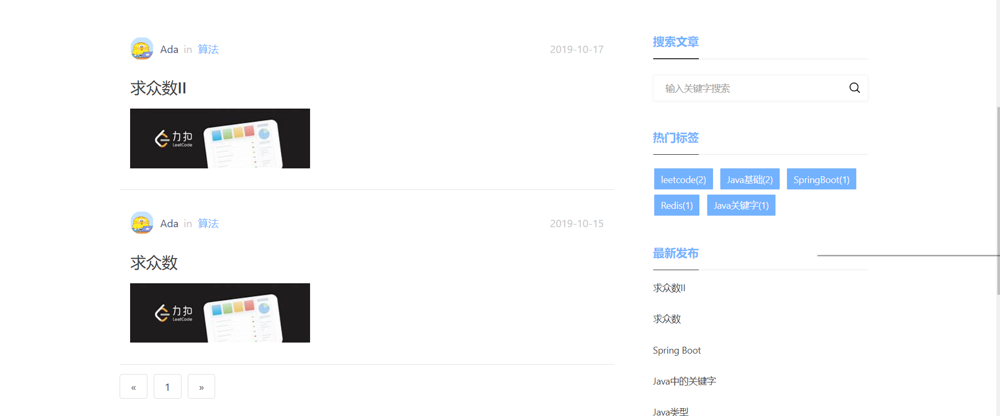

# 1. 个人博客网站
## 1.1. 模块
### 1.1.1. 网站前台
- 文章展示
- 关于
- 友情链接
### 1.1.2. 管理后台
-   博客管理
-   评论管理
-   分类管理
 -  标签管理
 -  友情链接
 -  关于管理
## 1.2. 项目结构

# 2. 技术选型
- 基础环境
Win10 + JDK 1.8 
- 后端
Springboot 2.1.8+ mybatis + thymeleaf + mysql 5.7+ Bootstrap4 + jqgrid+markdown 编辑器+
- 前端
bootstrap4 + html + CSS+ jQuery +thymeleaf +sweetalert2

# 3. 展示页面
## 3.1. 网站首页
展示地址:http://www.isada.cn/
- 首页

- 内容详情页

- 友情链接

- 关于

## 3.2. 管理后台：

- 登陆首页

- 后台首页

- 其他

# 4. 使用
- 在_v_images下的web_db.sql是数据库文件，导入到mysql中
- 在idea上导入github项目，修改数据库端口就可以运行了
- 右键debug项目,然后访问`http:localhost:8080`既可以看到首页
- 访问`http:localhost:8080/admin/login`既可以进入管理后台
# 5. 注意事项
## 5.1. 密码
初始用户和密码为ada 和ada
## 5.2. 部署到云服务器上面
- 端口号修改成80就可以直接用项目的地址访问(如果你想好看点去掉端口号,即访问不需要加端口号访问的,修改端口好为80)

-  部署到云服务器上，在maven中打包成jar包，然后运行 java -jar xxx(文件名) ，即用ip端口号+项目号的时候就可以访问（想去除端口号参考上一点）

但是  java -jar xxx(文件名)  在关闭终端或者会话的时候就会停止运行，如需后台运行项目的话，可以改用
`nohup java -jar  xxx(文件名)>xxx.txt &`
可以指定文件名输出日志到xxx.txt文件中
# 6. 感谢
感谢13的博客
# 7. 更新
## 7.1. 1.2.0版本
-首页调整

- 评论功能调整（以弹窗的形式）

- 添加“关于”模块

## 7.2. 1.3.0版本更新
- 可以获取评论者的IP

- 修改了评论的bug

- 修改了分类的bug

- 更新网站为2020年